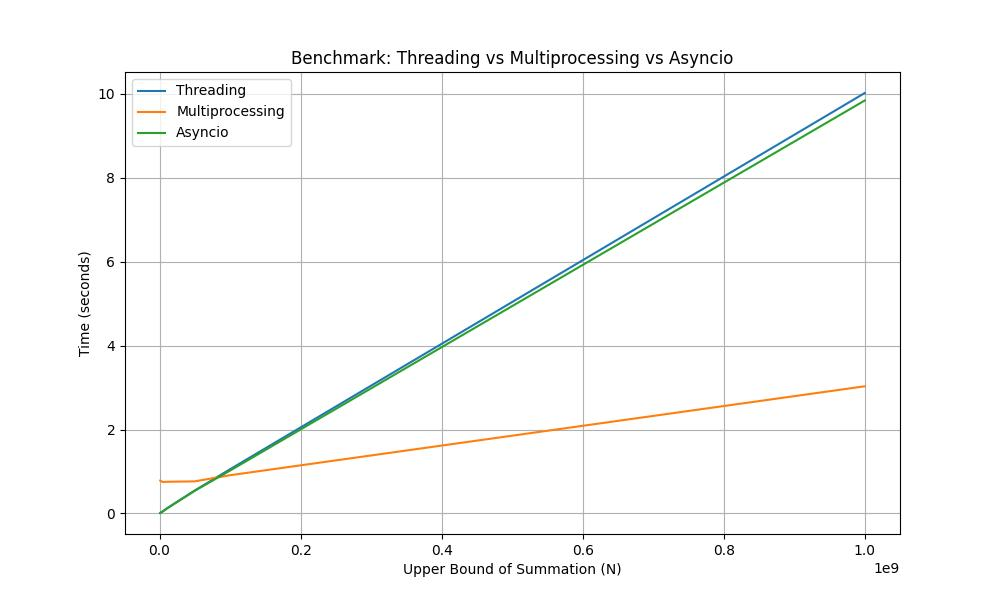
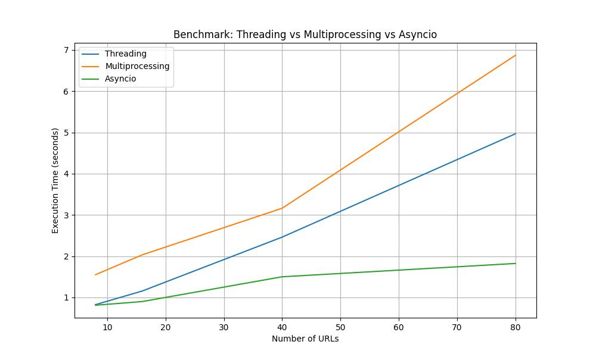

# Документация к Лабораторной работе 2

Данная лабораторная работа посвящена изучению многопоточности, многопроцессорности и асинхронного программирования в Python. Исследуются различные подходы для повышения производительности вычислений и ввода-вывода за счет параллельного выполнения задач.

## Общая информация

Лабораторная работа реализована с использованием трёх подходов:

- **Threading** – применение потоков для решения проблемы ввода-вывода и параллельного исполнения задач.
- **Multiprocessing** – использование процессов для разделения вычислительно тяжёлых задач.
- **Asyncio** – применение асинхронного программирования для повышения масштабируемости при выполнении задач ввода-вывода.

Целью работы является изучение особенностей и сравнительный анализ времени выполнения различных подходов на примерах двух задач: суммирования чисел и параллельного парсинга веб-страниц с сохранением данных в базу данных.

---

## Задача 1: Суммирование чисел

### Описание задачи 1

В данной задаче необходимо вычислить сумму чисел от 1 до N с использованием параллельного исполнения. Задача разбивается на несколько подзадач (частичных сумм), которые затем объединяются для получения окончательного результата. Использованы три подхода:

- Многопоточность (Threading)
- Многопроцессорность (Multiprocessing)
- Асинхронное программирование (Asyncio)

### Реализация задачи 1

В папке `task1` расположены реализации суммирования:

- [threads.py](students/K3340/Aleksei_Tiulenev/LR2/task1/implementations/threads.py) – реализация с использованием потоков.
- [processes.py](students/K3340/Aleksei_Tiulenev/LR2/task1/implementations/processes.py) – реализация с использованием процессов.
- [async_impl.py](students/K3340/Aleksei_Tiulenev/LR2/task1/implementations/async_impl.py) – реализация с использованием asyncio.

Код запуска тестирования находится в файле [main.py](students/K3340/Aleksei_Tiulenev/LR2/task1/main.py) и [benchmark.py](students/K3340/Aleksei_Tiulenev/LR2/task1/benchmark.py).

### Результаты тестирования задачи 1

Ниже представлен график времени выполнения для различных подходов:

---

## Задача 2: Параллельный парсинг веб-страниц

### Описание задачи 2

В задаче организован параллельный парсинг веб-страниц с сохранением извлечённых данных (заголовков страниц) в базу данных SQLite. Также реализованы три различных подхода:

- Парсинг с использованием потоков (Threading)
- Парсинг с использованием процессов (Multiprocessing)
- Парсинг с использованием асинхронного подхода (Asyncio)

В каждой реализации сайт запрашивается, HTML-страница анализируется с помощью BeautifulSoup, а затем извлекается заголовок страницы для сохранения в базу данных.

### Реализация задачи 2

Используемые файлы:

- [threads.py](students/K3340/Aleksei_Tiulenev/LR2/task2/implementations/threads.py) – реализация с использованием потоков.
- [processes.py](students/K3340/Aleksei_Tiulenev/LR2/task2/implementations/processes.py) – реализация с использованием процессов.
- [async_impl.py](students/K3340/Aleksei_Tiulenev/LR2/task2/implementations/async_impl.py) – реализация с использованием asyncio.

Основной файл для запуска задачи – [main.py](students/K3340/Aleksei_Tiulenev/LR2/task2/main.py). Для сброса базы данных используется скрипт [reset_db.py](students/K3340/Aleksei_Tiulenev/LR2/task2/reset_db.py).

### Результаты тестирования задачи 2

Ниже представлен график времени выполнения работы для различных подходов:

---

## Выводы

- **Threading:**  
  Хорош для задач ввода-вывода, однако ограничен GIL при вычислительно тяжёлых операциях.
- **Multiprocessing:**  
  Эффективен для вычислительно интенсивных задач за счёт использования независимых процессов, но имеет накладные расходы на создание и синхронизацию процессов.
- **Asyncio:**  
  Наиболее эффективен для I/O-bound задач, что подтверждается результатами по скорости парсинга, но требует иного подхода к организации кода.

Практический вывод – выбор подхода зависит от характера задачи. При работе с большим количеством сетевых запросов или операций ввода-вывода предпочтителен asyncio, а для тяжёлых вычислений – multiprocessing.

---

Данная документация содержит описание заданий, примеры реализации с использованием существующих файлов, а также результаты тестирования, представленные в виде графиков. Для подробностей можно обратиться к исходным файлам в соответствующих директориях.
